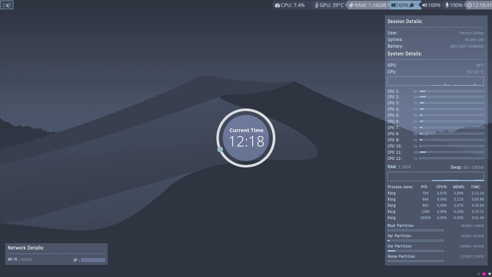

<h3>conky</h3>

These are my conky configs, i'm running a lua script from Closebox73 to display the time on a central ring, a fork from Closebox73's Dziban theme, modified to my liking, and a small script to display a little network info.

<b>IMPORTANT:</b> In order to run the lua script, you need to install the 'conky-lua' package from the AUR, or if you are on Debian, install 'conky-all'

Bellow is a preview of these scripts running:

