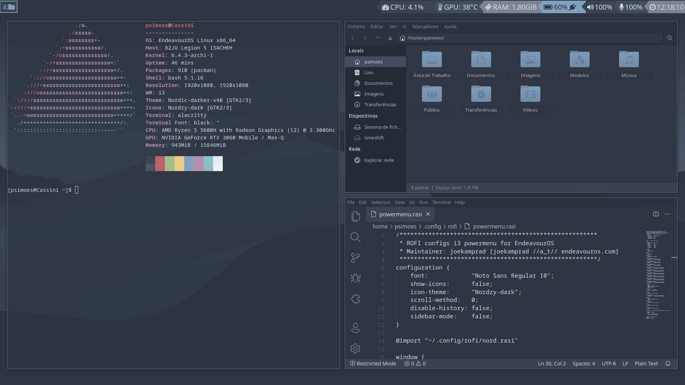

<h2>i3wm</h2>

Here are my config files necessary for running the i3wm with a nord theme.

My i3wm config has the following dependencies:

<ul>
    <li>bumblebee-status, (already present)</li>
    <li>fontawesome fonts, (for bumblebee-status)</li>
    <li>picom</li>
    <li>powerline fonts, (for bumblebee-status)</li>
</ul>

Additionally, i'm also running:

<ul>
    <li>conky</li>
    <li>nitrogen</li>
    <li>rofi</li>
    <li>xrandr</li>
</ul>

I won't go into detail on how to install what, since that's not the purpose of this repo...

Bellow is a preview of i3wm running on EndeavourOS:

